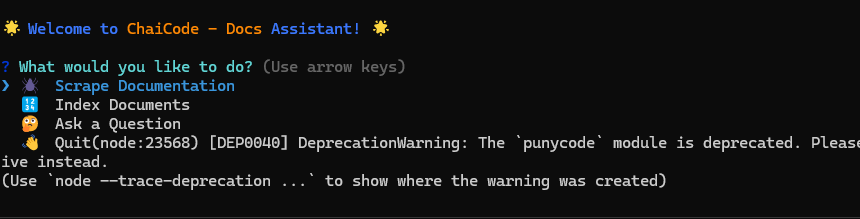
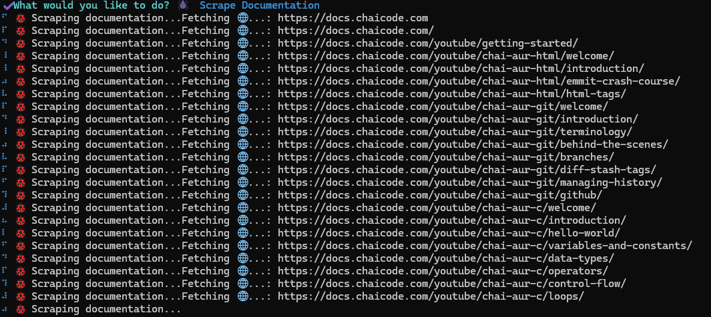
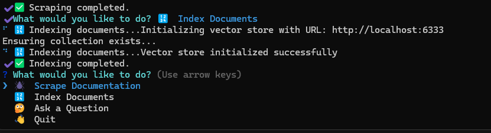
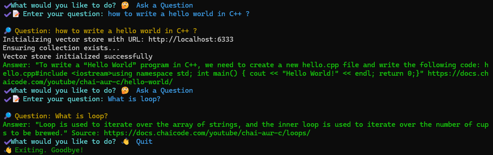

# 📚 ChaiCode Docs Assistant

A smart CLI tool that scrapes tutorial/documentation websites, indexes them using OpenAI embeddings + Qdrant vector database, and allows you to **ask questions interactively** over the knowledge base.

Built with **Node.js**, **LangChainJS**, **Qdrant**, **Inquirer**, **Chalk**, and **Ora** for a smooth developer experience.

---

## ✨ Features

- 🕷️ **Scrape documentation websites easily**
- 🧩 **Index content** with OpenAI and store in Qdrant
- 🤔 **Ask questions interactively** via CLI prompts
- 🧹 **Automatic text cleaning** (extracts only main content)
- 🛡️ **Handles missing pages** gracefully
- 🚀 **Works with local Docker Qdrant instance**
- 🎨 **Beautiful UX** with spinners, colors, and menus

---

## 📸 Screenshots

|           Welcome Screen            |             Scraping Docs             |           Indexing Content            |           Asking Questions           |
| :---------------------------------: | :-----------------------------------: | :-----------------------------------: | :----------------------------------: |
|  |  |  |  |

---

## 📦 Tech Stack

- Node.js
- LangChainJS
- OpenAI Embeddings
- Qdrant Vector Database
- Inquirer.js
- Chalk
- Ora
- Cheerio (for HTML parsing)

---

## 🛠️ Setup Instructions

### 1. Clone the Repository

```bash
git clone https://github.com/Devendra616/docAssistantCli.git
cd docAssistantCli
```

### 2. Install Dependencies

```bash
npm install
```

### 3. Create `.env` File

Create a `.env` file in the root:

```env
OPENAI_API_KEY=your-openai-api-key
QDRANT_URL=http://localhost:6333
```

> Make sure Qdrant is running on localhost via Docker.

### 4. Run the Application

```bash
npm start
```

---

## 🧩 Usage

When you run `npm start`, you'll see a menu like:

```
🌟 Welcome to ChaiCode Docs Assistant! 🌟

? What would you like to do?
❯ 🕷️  Scrape Documentation
  🔢  Index Documents
  🤔  Ask a Question
  👋  Quit
```

Select actions with the keyboard:

- **Scrape Documentation**: Crawl a website and save clean JSON
- **Index Documents**: Embed and store documents in Qdrant
- **Ask a Question**: Semantic search your documents!
- **Quit**: Exit the CLI

---

## 🐳 Running Qdrant Locally

If you don't have Qdrant running yet:

```bash
docker run -p 6333:6333 -p 6334:6334 qdrant/qdrant
```

The app will connect automatically to `http://localhost:6333`.

---

## 🤝 Contributing

Contributions, suggestions, and PRs are warmly welcome!  
Please open an issue to discuss your idea or submit a PR directly.

---

## 📄 License

Licensed under the [MIT License](LICENSE).

---

## 🔥 Let's make documentation smarter and searchable! 🔥
